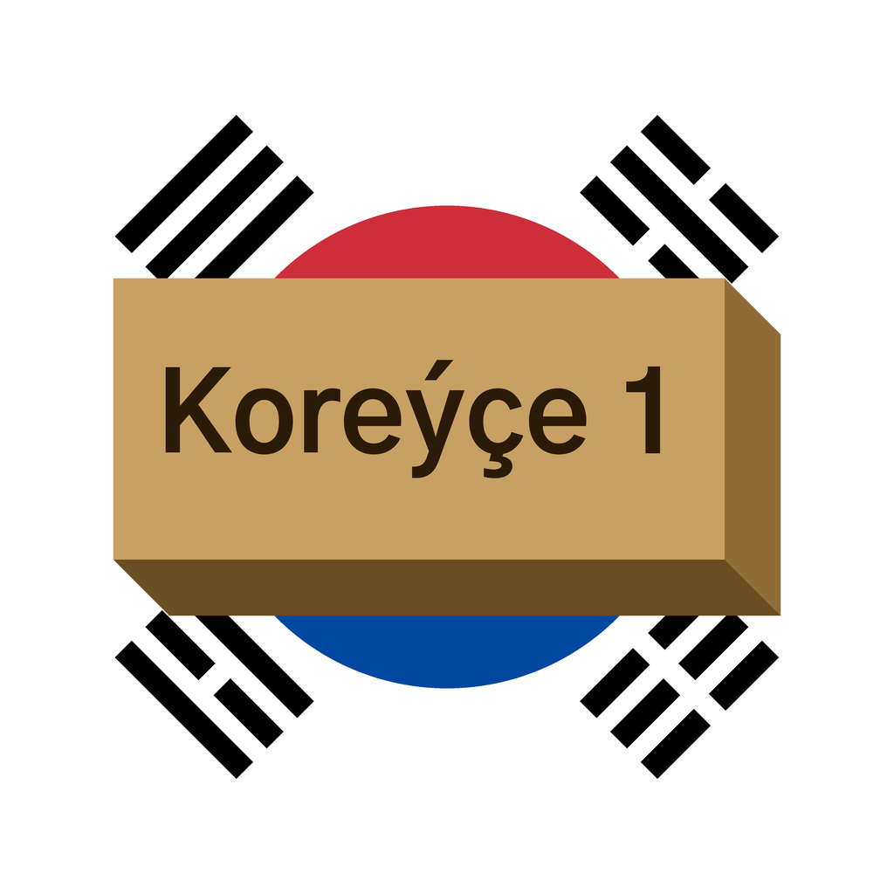

  

# Koreý dili 1

Türkmen dilinde koreý dilini öwrenmek üçin mobil goşundy.

Taslama başlandy — häzir pikirler we teklipler ýygnalýar. [Discussions](../../discussions)
sahypasynda ýazyň: haýsy okuw kitaby esas bolmaly, haýsy temalar gerek, bu goşundydan näme
isleýärsiňiz. Her bir pikir biziň üçin wajyp.

Bu goşundy Shapak-Apps dil tapgyrynyň bir bölegi. [Hytaý dili 1](https://github.com/Shapak-Apps/turkmen-chinese)
eýýäm App Store-da, [Iňlis dili 1](https://github.com/Shapak-Apps/turkmen-english) taýýarlanýar.
Şol bir tehniki binýat: sapaklar, bap synaglary, progres, doly oflaýn.

---

## English

A mobile app for learning Korean — fully in Turkmen. Part of the Shapak-Apps language series,
built on the same foundation as [Hytaý dili 1](https://github.com/Shapak-Apps/turkmen-chinese)
(already on the App Store): lessons, chapter exams, progress tracking, fully offline.

Development has started. Ideas and suggestions are welcome in [Discussions](../../discussions):
which textbook the course should be based on, which topics matter, what you want from the app.
